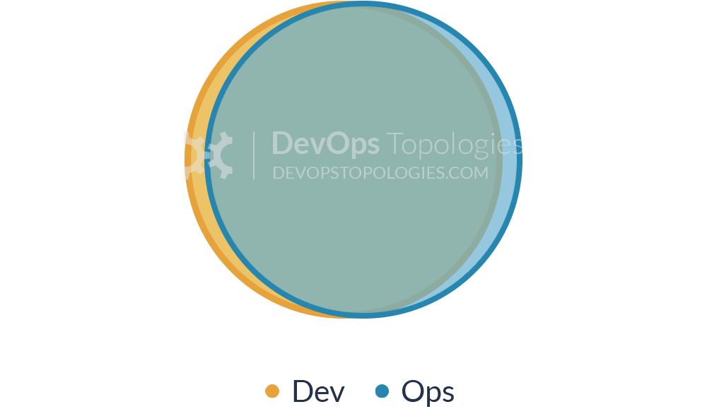

# O que é DevOps

## História

DevOps foi um termo cunhado pela primeira vez no Velocity 2009 por John Allspaw e Paul Hammond. O termo é uma contração entre **Development** e **Operations** e refere-se a um conjunto de práticas adotadas por times ágeis para tornar o processo de desenvolvimento e implantação mais rápido, confiável e repetível.

## Conceito

A cultura DevOps é aquele conjunto de práticas que visam melhorar a qualidade do software, tornando-o mais fácil de ser desenvolvido, implantado e mantido.
Essa cultura visa aproximar as atividades de desenvolvimento e operações em favor de um processo de produção de software mais fluído.
CALMS é um termo popular para descrever a cultura DevOps. É um acrônimo para:
 - Culture, cultura
 - Automation, automação
 - Lean 
 - Measurements, mensuração
 - Sharing, compartilhamento

 