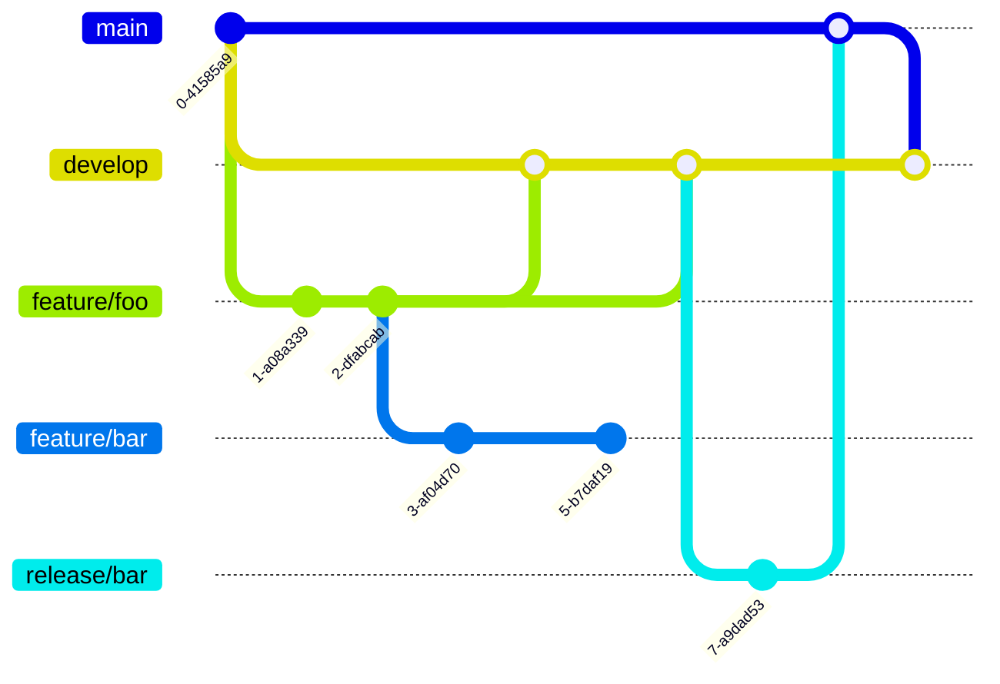

# Branching e Merging

# Conceito

_Branching_ e _Merging_ são características do Git que permitem o trabalho de equipes de forma paralela e assíncrona. 
_Branching_ significa que você pode criar uma ramificação no histórico do repositório e trabalhar de forma isolada das demais ramificações. Isso permite que modificações nessa ramificação possam ser validadas ou mesmo descartadas de forma facilitada. 
_Merging_ é o processo de unir uma ramificação a outra integrando assim o trabalho de multiplas frentes. 
Existem diferentes estratégias para _Branching_. Abaixo as mais comuns:

* **Git Flow**

