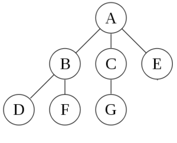

# Navegar e manipular arquivos

## Conteitos

* **Arquivo** é onde são armazenados textos, programas, imagens, etc.
* **Diretório** é um 'agrupador' de arquivos;
* Diretórios podem conter arquivos ou outros diretórios;
* Quando um diretório é posto dentro de outro, é criada uma [estrutura de árvore](https://pt.wikipedia.org/wiki/Árvore_(estrutura_de_dados));

## Comandos

* `cd`, muda de diretório;
* `ls`, lista o conteúdo de um diretório;
* `pwd`, mostra em qual estrutura de diretório está;
* `cp`, copia um arquivo ou diretório;
* `mv`, move um arquivo ou diretório;
* `rm`, remove um arquivo ou diretório;

## Aplicativos

* `vi` ou `vim`, editor de texto de linha de comando. Util para criar ou editar arquivos de texto;